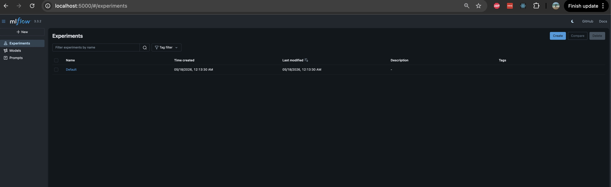
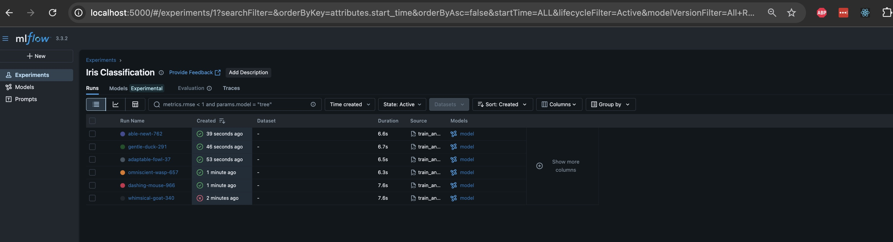
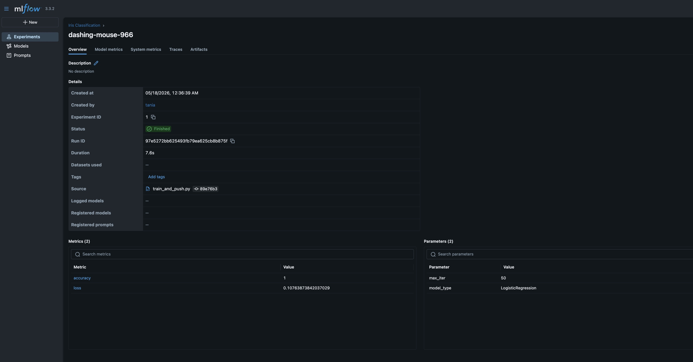
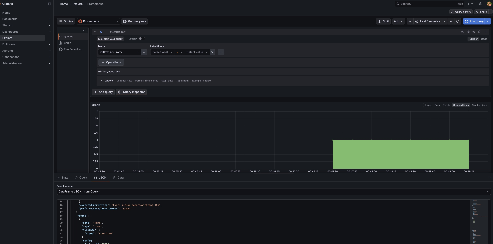
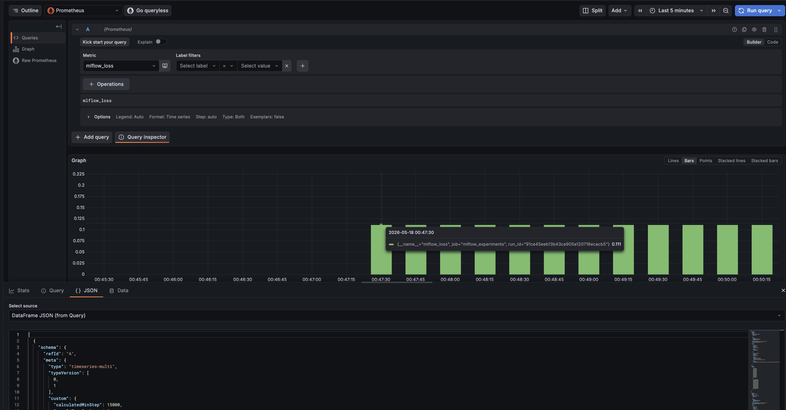

# MLOps Experiments — MLflow Tracking on EKS

## Огляд

Проєкт для трекінгу ML-експериментів через MLflow, розгорнутий на AWS EKS.

Сервіси:
- **MLflow Tracking Server** — логування параметрів, метрик, артефактів
- **MinIO** — S3-сумісне сховище артефактів (bucket `mlflow-artifacts`)
- **PostgreSQL** — база метаданих MLflow
- **Prometheus PushGateway** — прийом метрик для Grafana

Усі сервіси описані як ArgoCD Applications у `argocd/applications/`.

## Структура проєкту

```
mlops-experiments/
├── argocd/
│   └── applications/
│       ├── mlflow.yaml
│       ├── minio.yaml
│       ├── postgres.yaml
│       └── pushgateway.yaml
├── experiments/
│   ├── train_and_push.py
│   └── requirements.txt
├── best_model/
│   └── model/          # з'являється після запуску скрипта
└── README.md
```

## Перевірка сервісів у кластері

```bash
# Pods у namespace application
kubectl get pods -n application

# Очікуваний результат:
# minio-...          1/1  Running
# mlflow-...         1/1  Running
# mlflow-postgres-postgresql-0  1/1  Running

# PushGateway у namespace monitoring
kubectl get pods -n monitoring

# ArgoCD Applications
kubectl get applications -n infra-tools
```

## Port-forward

Для доступу до сервісів локально:

```bash
# MLflow UI (http://localhost:5000)
kubectl port-forward svc/mlflow 5000:5000 -n application

# PushGateway (http://localhost:9091)
kubectl port-forward svc/pushgateway-prometheus-pushgateway 9091:9091 -n monitoring

# MinIO (http://localhost:9000)
kubectl port-forward svc/minio 9000:9000 -n application
```

## Запуск train_and_push.py

### 1. Встановіть залежності

```bash
cd experiments/
pip install -r requirements.txt
```

### 2. Запустіть port-forward (в окремих терміналах)

```bash
kubectl port-forward svc/mlflow 5000:5000 -n application &
kubectl port-forward svc/pushgateway-prometheus-pushgateway 9091:9091 -n monitoring &
kubectl port-forward svc/minio 9000:9000 -n application &
```

### 3. Запустіть скрипт

```bash
MLFLOW_TRACKING_URI=http://localhost:5000 \
MLFLOW_S3_ENDPOINT_URL=http://localhost:9000 \
AWS_ACCESS_KEY_ID=minio \
AWS_SECRET_ACCESS_KEY=minio123 \
PUSHGATEWAY_URL=localhost:9091 \
python train_and_push.py
```

Скрипт:
- Завантажує датасет Iris
- Тренує LogisticRegression з різними `max_iter` (50, 100, 200, 500, 1000)
- Для кожного запуску логує параметри та метрики в MLflow, зберігає модель як артефакт
- Пушить `accuracy` та `loss` у PushGateway з міткою `run_id`
- Знаходить найкращий run за accuracy та копіює модель у `best_model/`

## Перегляд результатів в MLflow UI

1. Відкрийте http://localhost:5000
2. Оберіть експеримент **Iris Classification**
3. Побачите всі runs з параметрами (`max_iter`), метриками (`accuracy`, `loss`) та артефактами (model)

### MLflow Experiments — початковий стан

Після розгортання MLflow UI показує Default експеримент:



### MLflow Experiments — після запуску train_and_push.py

6 runs із різними параметрами `max_iter`, кожен з моделлю як артефактом:



### MLflow — деталі окремого run

Метрики (accuracy=1, loss=0.1076) та параметри (max_iter=50, model_type=LogisticRegression):



## Перегляд метрик у Grafana

1. Відкрийте Grafana → **Explore**
2. Оберіть datasource **Prometheus**
3. Введіть запит:
   - `mlflow_accuracy` — точність моделей
   - `mlflow_loss` — функція втрат
4. Можна побудувати графіки або табличний вигляд

### Grafana — mlflow_accuracy

Графік accuracy = 1 для всіх runs, отриманий через Prometheus PushGateway:



### Grafana — mlflow_loss

Графік loss ≈ 0.111 для всіх runs (bar view):



## Сервісні адреси (всередині кластера)

| Сервіс | URL |
|--------|-----|
| MLflow | `http://mlflow.application.svc.cluster.local:5000` |
| MinIO | `http://minio.application.svc.cluster.local:9000` |
| PostgreSQL | `mlflow-postgres-postgresql.application.svc.cluster.local:5432` |
| PushGateway | `http://pushgateway-prometheus-pushgateway.monitoring.svc.cluster.local:9091` |
